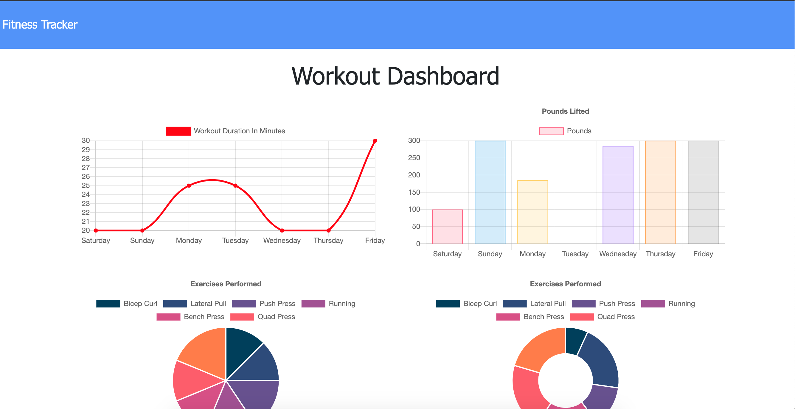
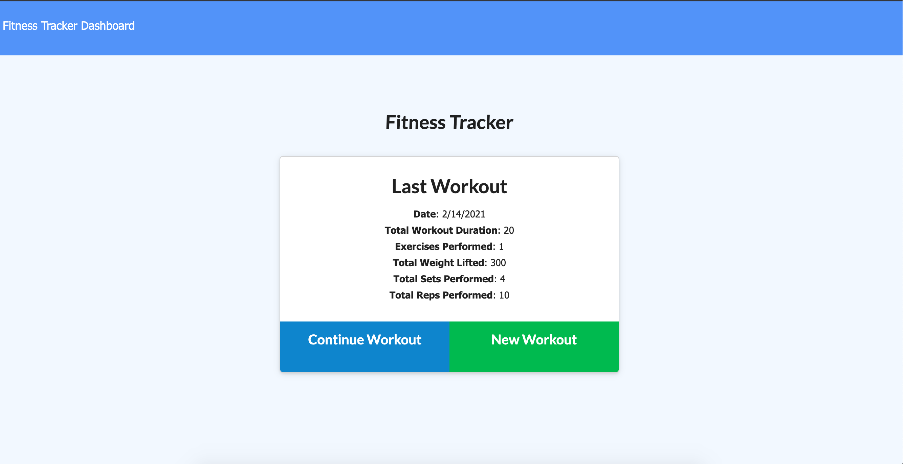

# Workout Tracker 

  
  ## Description
  
Allows user to create, view and track daily workouts by logging multiple exercises in a workout on any given day. You can also track the name, type, weight, sets, reps, and duration of the exercise. Another cool feature, if the exercise is cardo you can track the distance traveled! 
  
  ## Table of Contents 
  
  * [Installation](#installation)
  
  * [Deploy](#deploy)
  
  * [Screenshots](#screenshots)
  
  ## Installation
  
  To install necessary dependencies, run the following command:
  
  ```
  npm i
  ```
  
  ## Deploy
Deployed on Heroku
[WorkoutTracker](https://serene-spire-83164.herokuapp.com/?id=602d768f3cdda100156412ec)
  
  
## Screenshots





  
  
  
  
